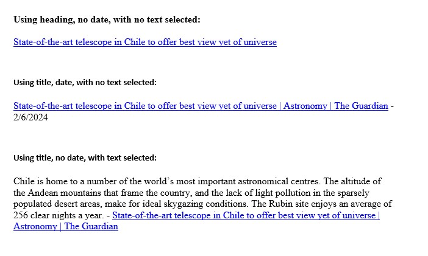

# Copy Hyperlink

## Description
An extension for the Chrome browser that allows you to copy the source URL along with the selected text.

## How to Use
When no text is selected, clicking the extension icon will copy the webpage title or heading (see below, under Options) as a hyperlink to the webpage to the clipboard. When text is selected, the selected text is copied, along with the title/heading as hyperlink.

## Options
By default, the extension uses the h1 heading when available. When no h1 element can be found, or when the user turns off the "use heading" options, it uses the page title.

The user can also choose to include the current date.

## Examples
Depending on the options chosen, this is what the pasted selection will look like:

